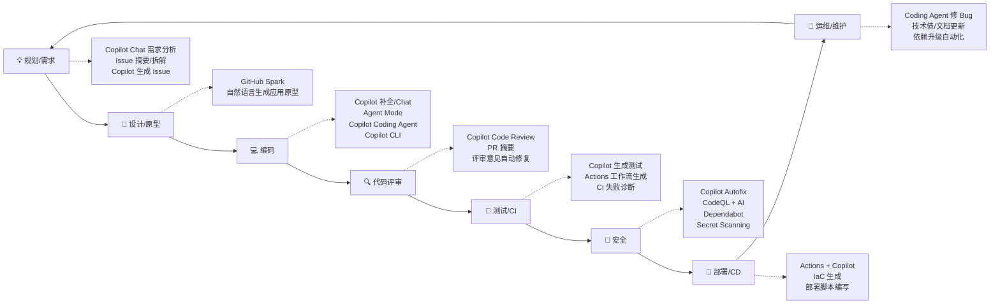
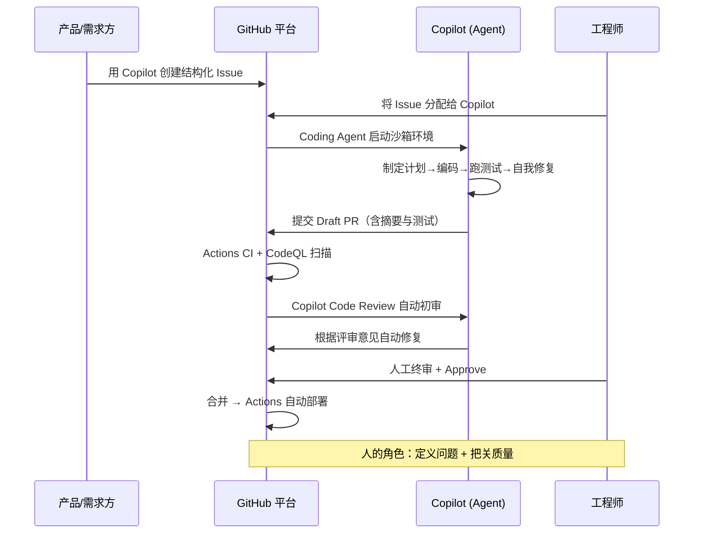

# GitHub 在 SDLC 中的 AI 能力全景分析

> 目标：梳理 GitHub 平台在软件开发生命周期（SDLC）各阶段的 AI 能力，评估其"端到端 AI 交付"的成熟度。

---

## 一、总览：一张图看懂

---

## 二、按 SDLC 阶段逐一分析

### 1️⃣ 规划与需求（Plan）

| 能力 | 说明 | 形态 |
|------|------|------|
| **Copilot Chat（github.com）** | 对话式探索代码库、回答"这个仓库做什么"、辅助需求分析 | Web / IDE |
| **Issue AI 能力** | 用 Copilot 创建 Issue（自然语言→结构化 Issue）、摘要长讨论、自动打标签/分类 | github.com |
| **Issue 拆解** | 将大需求拆成子任务（sub-issues），并可直接分配给 Copilot | github.com |
| **Copilot Spaces** | 将需求文档、代码、上下文组织成"空间"，让 AI 基于组织知识回答 | Web |

**成熟度：★★★☆☆** — 需求管理 AI 能力在增强中，但项目级规划（路线图、估算）仍以人为主。

### 2️⃣ 设计与原型（Design）

| 能力 | 说明 | 形态 |
|------|------|------|
| **GitHub Spark** | 自然语言描述 → 直接生成可运行的全栈微应用（含数据、AI 能力、托管） | Web（Pro+/企业） |
| **Copilot Chat 架构讨论** | 技术选型、架构方案对比、生成架构图（Mermaid） | IDE / Web |

**成熟度：★★★☆☆** — Spark 适合原型验证；复杂系统设计仍需架构师主导。

### 3️⃣ 编码（Code）— 最成熟的阶段

| 能力 | 说明 | 形态 |
|------|------|------|
| **代码补全（Completions）** | 行级/块级补全，最经典的 Copilot 能力 | IDE |
| **Copilot Chat / Edits** | 对话式编程、多文件编辑 | IDE |
| **Agent Mode** | IDE 内自主智能体：自行决定改哪些文件、运行终端命令、自我迭代修复 | VS Code / JetBrains 等 |
| **Copilot Coding Agent** | 云端异步智能体：把 Issue 分配给 Copilot，它在隔离环境中写代码、跑测试、提 Draft PR | github.com / Mobile / CLI |
| **Copilot CLI** | 终端里的 AI 助手，命令解释与执行、脚本编写 | CLI |
| **多模型支持** | 可选 Claude、GPT、Gemini 等不同模型；支持 BYOM | 全平台 |
| **MCP（Model Context Protocol）** | 连接外部工具/数据源，扩展智能体能力（如 GitHub MCP Server、Playwright、内部系统） | Agent 生态 |
| **自定义指令 / Custom Agents** | `copilot-instructions.md`、AGENTS.md、组织级定制，让 AI 符合团队规范 | 全平台 |

**成熟度：★★★★★** — 编码是 GitHub AI 的核心主场，"同步结对（Agent Mode）+ 异步委托（Coding Agent）"双模式齐备。

### 4️⃣ 代码评审（Review）

| 能力 | 说明 | 形态 |
|------|------|------|
| **Copilot Code Review** | AI 自动评审 PR：发现 Bug、逻辑错误、代码规范问题，给出可一键应用的修改建议 | github.com / IDE |
| **PR 摘要生成** | 自动生成 PR 描述与变更摘要，降低评审者理解成本 | github.com |
| **评审→修复闭环** | 评审意见可直接交给 Coding Agent 自动修复并更新 PR | github.com |
| **组织级评审规则** | 可配置为仓库必备评审步骤（rulesets），自定义评审指令 | 企业管理 |

**成熟度：★★★★☆** — AI 初审 + 人工终审已成为主流实践，可显著缩短评审周期。

### 5️⃣ 测试与 CI（Build & Test）

| 能力 | 说明 | 形态 |
|------|------|------|
| **测试生成** | Copilot 生成单元测试/边界用例；Coding Agent 提 PR 时自带测试 | IDE / Agent |
| **Actions 工作流生成** | 自然语言生成/调试/优化 GitHub Actions YAML | IDE / Chat |
| **CI 失败诊断** | Copilot 解释 Actions 构建失败原因并给出修复建议 | github.com |
| **Coding Agent 自验证** | 智能体在沙箱中运行构建、测试、Lint，通过后才提交 PR | Agent 环境 |

**成熟度：★★★★☆** — 测试生成很成熟；CI 智能化（自动修复失败流水线）在快速演进。

### 6️⃣ 安全（Secure）— GitHub Advanced Security + AI

| 能力 | 说明 | 形态 |
|------|------|------|
| **Copilot Autofix** | CodeQL 发现漏洞 → AI 自动生成修复建议，覆盖存量告警与新增代码 | Code Scanning |
| **Security Campaigns** | 批量对存量安全债发起 AI 修复战役 | 企业级 |
| **Secret Scanning + AI** | AI 提升非结构化密钥（如密码）检测准确率 | 全仓库 |
| **Dependabot** | 依赖漏洞自动升级 PR；结合 Copilot 处理破坏性变更 | 自动化 |
| **编码时防护** | Copilot 内置漏洞模式过滤（注入、硬编码密钥等），生成时即拦截 | IDE |

**成熟度：★★★★☆** — "发现→修复"闭环是 GitHub 安全 AI 的最大差异化（Found means fixed）。

### 7️⃣ 部署与发布（Deploy）

| 能力 | 说明 | 形态 |
|------|------|------|
| **Actions CD 工作流生成** | AI 编写部署流水线（部署到 Azure/AWS/K8s 等） | Chat / IDE |
| **IaC 辅助** | 生成/审查 Terraform、Bicep、Dockerfile、K8s manifests | IDE |
| **环境与发布策略** | 结合 branch protection、environments、审批门禁，AI 产出受既有管控约束 | 平台治理 |

**成熟度：★★★☆☆** — 部署本身仍靠 Actions 自动化为主，AI 主要扮演"流水线编写助手"；发布决策留给人。

### 8️⃣ 运维与维护（Operate & Maintain）

| 能力 | 说明 | 形态 |
|------|------|------|
| **Bug 修复委托** | 线上 Issue 直接 assign 给 Coding Agent，自动产出修复 PR | github.com |
| **技术债治理** | 批量委托重构、依赖升级、文档补全等低风险任务 | Agent |
| **代码考古/理解** | Chat 解释遗留代码、生成文档、回答"为什么这么写" | Web / IDE |
| **Copilot 使用度量** | 组织级 Copilot 使用指标 API/仪表盘，度量 AI 采纳效果 | 企业管理 |

**成熟度：★★★★☆** — 维护类任务（明确、重复、低风险）是 Coding Agent 的最佳场景。

---

## 三、端到端 AI 交付：能力串联

一个典型的"AI 优先"交付流：

### 端到端成熟度评估

| 阶段 | AI 覆盖 | 人的角色 |
|------|:---:|------|
| 规划/需求 | ★★★☆☆ | 主导：定义问题与优先级 |
| 设计/原型 | ★★★☆☆ | 主导：架构决策 |
| **编码** | ★★★★★ | 协作/委托 |
| **评审** | ★★★★☆ | 终审把关 |
| 测试/CI | ★★★★☆ | 定义质量标准 |
| **安全** | ★★★★☆ | 例外处理 |
| 部署 | ★★★☆☆ | 发布决策 |
| 维护 | ★★★★☆ | 委托 + 抽查 |

---

## 四、关键结论

1. **GitHub 是目前 SDLC AI 覆盖最完整的单一平台**：从 Issue 到部署都在同一平台内，AI 上下文不断链（Issue↔PR↔Code↔CI↔Security 天然打通）。

2. **双智能体模式是核心架构**：
   - **同步**：Agent Mode（IDE 内实时结对）
   - **异步**：Coding Agent（云端自主交付 PR）— 这是"端到端交付"的关键载体。

3. **"AI 干活、人把关"的治理内建**：Coding Agent 受 branch protection、必须人工 Approve、CI 必须通过等既有管控约束，企业可放心规模化。

4. **安全闭环是差异化优势**：CodeQL + Copilot Autofix 实现"发现即修复"，安全左移真正落地。

5. **可扩展性靠 MCP + 自定义指令**：接入内部系统、知识库、部署平台后，端到端自动化程度可进一步提升。

6. **当前短板**：规划/估算、复杂架构设计、生产环境运维（可观测性/事故响应）AI 化程度相对低——这些环节仍需人主导或依赖第三方工具（如 Azure SRE Agent 等）补位。

---

## 五、落地建议（企业视角）

| 优先级 | 行动 | 预期收益 |
|:---:|------|------|
| P0 | 全员启用 Copilot 补全 + Chat + Code Review | 编码效率 +30~55%，评审周期缩短 |
| P0 | 配置 `copilot-instructions.md` 团队规范 | AI 产出符合团队标准 |
| P1 | 用 Coding Agent 承接 Bug 修复/小需求/技术债 | 释放工程师做高价值工作 |
| P1 | 开启 GHAS：CodeQL + Autofix + Dependabot | 安全债持续下降 |
| P2 | MCP 接入内部系统，构建自定义 Agent | 端到端自动化率提升 |
| P2 | 建立 AI 使用度量与 ROI 看板 | 数据驱动持续优化 |
