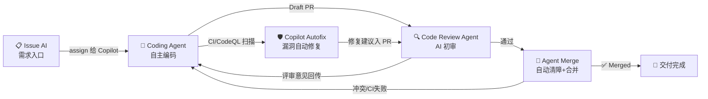
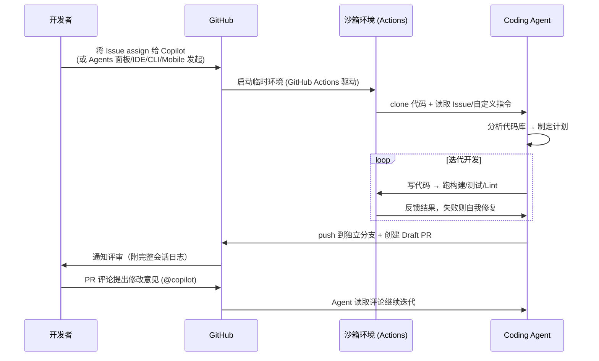
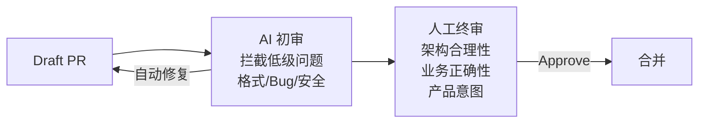
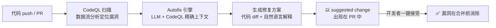
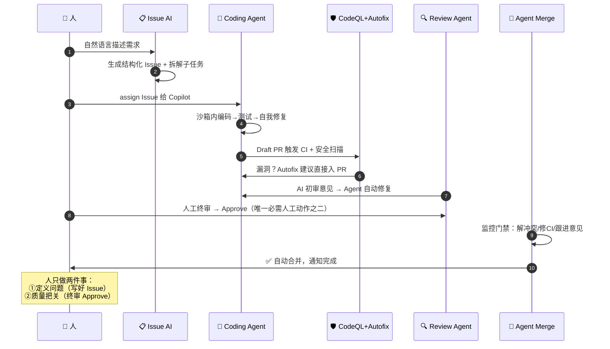

# GitHub 五大核心 AI 功能深度分析

> Issue AI · Coding Agent · Code Review Agent · Agent Merge · Copilot Autofix
> —— 这五个能力串联起来，构成 "Issue → PR → 评审 → 合并 → 安全修复" 的端到端 AI 交付闭环。

---

## 功能全景与闭环关系

---

## 1️⃣ Issue AI —— 需求管理的 AI 入口

### 是什么
GitHub Issues 中内置的一组 Copilot 能力，让 Issue 从"人工撰写的文本"变成"AI 可执行的任务定义"。

### 核心能力

| 能力 | 说明 |
|------|------|
| **自然语言创建 Issue** | 在 github.com 对 Copilot 说"用户反馈登录页在 Safari 崩溃"，AI 自动生成结构化 Issue（标题、复现步骤、标签、指派建议），支持一次批量创建多个 |
| **Issue 模板匹配** | 自动识别并套用仓库的 Issue Template / Issue Forms |
| **摘要与解释** | 长讨论串一键摘要；解释 Issue 中引用的代码/报错 |
| **子任务拆解（Sub-issues）** | 大需求拆成子 Issue 树，每个子任务可独立分配给人或 Copilot |
| **重复检测与去重** | 创建时提示相似 Issue，减少重复工单 |
| **assign 给 Copilot** | Issue 可直接指派给 `Copilot` 这个"虚拟协作者"，触发 Coding Agent（见下节）|

### 工作机制
- Issue 是 Coding Agent 的**最佳提示词载体**：标题 = 任务目标，正文 = 验收标准，评论 = 补充上下文。Agent 会完整读取 Issue 内容（含图片）作为任务输入。
- 支持从 Issue 直接生成实现计划，人确认后再启动编码。

### 最佳实践
- ✅ Issue 写清楚"验收标准"（Acceptance Criteria），Agent 产出质量显著提升
- ✅ 适合委托：Bug 修复、UI 小改、测试补全、文档更新
- ❌ 不适合：目标模糊（"让系统更快"）、需要跨团队决策的需求

### 定位
**闭环的起点**——把需求变成 AI 可消费的结构化任务。

---

## 2️⃣ Coding Agent —— 云端异步自主编码

### 是什么
GitHub 官方的云端自主编码智能体。把 Issue（或一句话任务）交给它，它在 GitHub 云端的隔离环境中独立完成编码，最终产出一个 Draft PR 等你评审。**这是端到端 AI 交付的核心载体。**

### 工作原理

### 关键技术特性

| 特性 | 细节 |
|------|------|
| **执行环境** | 基于 GitHub Actions 的临时沙箱，任务结束即销毁；用 `copilot-setup-steps.yml` 预装依赖 |
| **网络防火墙** | 默认限制出站网络，防数据外泄；管理员可配置白名单 |
| **权限边界** | 只能 push 到自己创建的 `copilot/*` 分支；**不能** approve/merge PR；触发的 CI 需人批准才运行 |
| **上下文来源** | Issue 内容、仓库代码、`copilot-instructions.md`、AGENTS.md、历史 PR 模式 |
| **MCP 扩展** | 通过 Model Context Protocol 接入外部工具（浏览器测试、内部 API、数据库 schema 等）|
| **可追溯性** | 完整 session log：每一步推理、命令、文件变更都可回放审计 |
| **多任务并行** | 可同时委托多个任务，在 Agents 面板（Mission Control）统一跟踪 |
| **发起入口** | github.com Agents 面板、Issue assign、VS Code、CLI、Mobile、MCP API |

### 安全治理（企业关注点）
1. Draft PR 必须**人工 approve** 才能合并（且发起者本人的 approve 不算，需另一人）
2. 受 branch protection / rulesets 完整约束
3. 组织可统一开关、按仓库配置策略
4. 所有行为以 `Copilot` 身份记录，审计清晰

### 适用场景评估

| 场景 | 适合度 | 原因 |
|------|:---:|------|
| Bug 修复（有明确复现） | ⭐⭐⭐⭐⭐ | 目标清晰、可自验证 |
| 测试覆盖率提升 | ⭐⭐⭐⭐⭐ | 重复性高、低风险 |
| 技术债/小重构 | ⭐⭐⭐⭐ | 范围可控 |
| 中型新功能 | ⭐⭐⭐ | 需要好的 Issue 描述 |
| 跨服务架构变更 | ⭐⭐ | 上下文超出单仓库 |
| 核心算法/高风险模块 | ⭐ | 需人主导 |

### 定位
**闭环的引擎**——把"任务"变成"可评审的 PR"，人从执行者变成委托者。

---

## 3️⃣ Code Review Agent —— AI 代码评审

### 是什么
Copilot 作为"第一位评审者"自动审查 PR，在人工评审前拦截问题、降低评审负担。已从"逐行提建议"进化为**具备上下文收集能力的智能体式评审**（agentic review）。

### 核心能力

| 能力 | 说明 |
|------|------|
| **自动初审** | PR 创建时自动触发（可配置为仓库规则），几分钟内给出评审意见 |
| **问题类型** | 逻辑错误、潜在 Bug、性能问题、错误处理缺失、命名/可读性、安全隐患 |
| **可执行建议** | 评审意见附带 suggested changes，可一键 commit |
| **上下文评审** | 不只看 diff——会探索代码库相关文件，理解变更在项目中的影响（agentic 能力）|
| **自定义评审规范** | 通过 `copilot-instructions.md` / 评审专用指令定义团队关注点（如"检查所有 SQL 是否参数化"）|
| **PR 摘要** | 自动生成变更说明，帮人快速建立评审上下文 |
| **评审→修复闭环** | 评审意见可直接转给 Coding Agent 自动修复，形成 "AI 审 → AI 改" 循环 |
| **内置安全检查** | 评审时融合安全扫描视角，减少安全问题流入人工评审 |

### 与人工评审的关系

- AI 负责**广度**（每行都看、不疲劳、秒级响应）
- 人负责**深度**（业务语义、架构取舍、"该不该做"）

### 治理配置
- 仓库级：rulesets 设为必需评审步骤，自动对所有 PR 生效
- 组织级：统一启用策略、评审指令标准化
- 对 Coding Agent 产出的 PR 同样生效 → **AI 写的代码先过 AI 评审**

### 局限
- 无法判断业务需求正确性（代码"对"≠需求"对"）
- 偶有误报，需团队调校指令降噪
- 不能替代 approve——GitHub 明确 AI 评审不计入必需人工批准数

### 定位
**闭环的质检站**——把人工评审从"找茬"升级为"把关"。

---

## 4️⃣ Agent Merge —— 自动清障与合并（"最后一公里"）

### 是什么
让 Copilot 智能体**监控 PR 直到合并完成**的能力：自动解决合并冲突、修复 CI 失败、响应评审意见，条件满足后自动执行合并。解决了此前"AI 写完代码，人还得回来收尾"的断点。

### 核心能力

| 能力 | 说明 |
|------|------|
| **合并冲突自动解决** | PR 出现冲突时"Fix with Copilot"一键委托：云端 Agent 分析双方变更意图、生成语义正确的解决方案（非机械合并）、运行构建/测试验证后 push |
| **CI 失败自动修复** | 监测到检查失败，Agent 定位原因并提交修复 |
| **评审意见跟进** | 自动响应 review comments 并更新代码 |
| **条件式自动合并** | 所有门禁（CI 绿、必需 approve 到位、无冲突）满足后自动合并，随即停止监控 |
| **后台持续运行** | 在后台守护 PR 状态，无需人盯守 |

### 与传统 auto-merge 的区别

| | GitHub 传统 auto-merge | Agent Merge |
|---|---|---|
| 冲突出现 | ❌ 停止，等人处理 | ✅ AI 分析并解决 |
| CI 失败 | ❌ 停止，等人修复 | ✅ AI 定位并修复 |
| 评审提意见 | ❌ 等人改代码 | ✅ AI 响应修改 |
| 本质 | 被动等待条件满足 | **主动清除障碍** |

### 安全边界
- 不绕过任何 branch protection：必需的人工 approve、必需的 CI 检查依然强制
- "自动合并"= 条件满足后代人执行点击，**不是跳过门禁**
- Business/Enterprise 需管理员显式启用；可细粒度控制 Agent 可执行的动作

### 典型场景
- 依赖升级 PR（Dependabot）：冲突频发但修改机械 → 最佳场景
- 文档/配置类低风险 PR 的全自动流转
- 长期开放的 PR 因主干快速演进反复冲突 → Agent 持续 rebase 保鲜

### 定位
**闭环的收口**——补上"PR 已批准但没人合并/合并被冲突卡住"的最后断点，让 Issue→Merged 真正无人值守成为可能（在门禁允许的前提下）。

---

## 5️⃣ Copilot Autofix —— 安全漏洞自动修复

### 是什么
GitHub Advanced Security（GHAS / Code Security）的 AI 能力：CodeQL 等扫描发现漏洞后，AI 自动生成**可直接提交的修复代码**。理念是 **"Found means fixed"（发现即修复）**。

### 工作原理

关键：不是让 LLM 盲猜，而是把 **CodeQL 的精确分析结果**（漏洞类型、污点数据流路径、源码位置）作为上下文喂给模型，因此修复准确率远高于通用 AI。修复可能跨多个文件、甚至引入新依赖，并附带解释说明。

### 覆盖范围

| 维度 | 说明 |
|------|------|
| **新增代码（PR 时）** | PR 触发扫描 → 漏洞告警自动附带修复建议 → 合并前消除（安全左移）|
| **存量告警** | 对历史积压的 security debt 逐条生成修复 |
| **Security Campaigns** | 企业批量圈选存量漏洞发起"修复战役"，AI 批量生成修复 PR，安全团队统一跟踪 |
| **漏洞类型** | SQL 注入、XSS、路径遍历、SSRF、硬编码凭据、不安全反序列化等 CodeQL 支持的主流类型（覆盖 90%+ 常见告警类别）|
| **语言** | JavaScript/TypeScript、Python、Java、C#、Go、Ruby、C/C++、Kotlin/Swift 等 |

### 与其他四个功能的协同
- Coding Agent 产出的 PR → CodeQL 扫描 → Autofix 兜底 → **AI 写的代码由 AI 安全体检**
- Code Review Agent 评审时融合安全视角，Autofix 提供精确修复
- Agent Merge 等待安全检查通过才合并 → 安全门禁内建于自动化流程

### 效果数据（GitHub 官方口径）
- 使用 Autofix 后漏洞修复速度提升 **3 倍以上**（部分类型如 XSS 快 7 倍+）
- 大幅降低对安全专家的依赖：开发者无需先成为安全专家才能修漏洞

### 局限
- 依赖 CodeQL 检出能力——扫不出的漏洞无从修复
- 修复建议仍需人确认（可能改变边缘行为）
- 需要 GHAS / Code Security 许可（收费，公共仓库免费）

### 定位
**闭环的安全底座**——让安全检查从"卡点"变成"自愈"，是 GitHub 相对其他 AI 编码平台最强的差异化。

---

## 六、五者协同：端到端交付全流程

### 人机分工总结

| 环节 | AI 做 | 人做 |
|------|------|------|
| 需求 | 结构化、拆解、去重 | 定义问题与优先级 |
| 编码 | 全部执行 + 自测 | 提供验收标准 |
| 安全 | 扫描 + 生成修复 | 确认接受修复 |
| 评审 | 初审 + 自动修复意见 | 终审业务正确性 |
| 合并 | 清障 + 执行合并 | 设定门禁规则 |

### 落地顺序建议
1. **先开 Code Review Agent + Autofix**（零流程改造，立即降噪提效）
2. **再用 Coding Agent 承接低风险任务**（Bug/测试/文档），配好 `copilot-instructions.md`
3. **最后开 Agent Merge**（在门禁健全的仓库先试点依赖升级类 PR）
4. 全程用 Issue 质量（验收标准清晰度）作为 AI 交付成功率的第一杠杆
